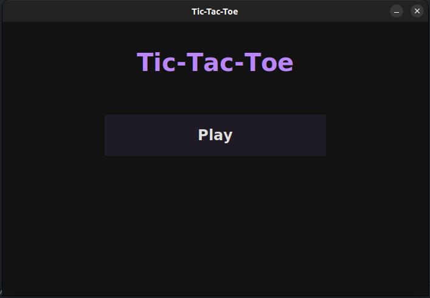
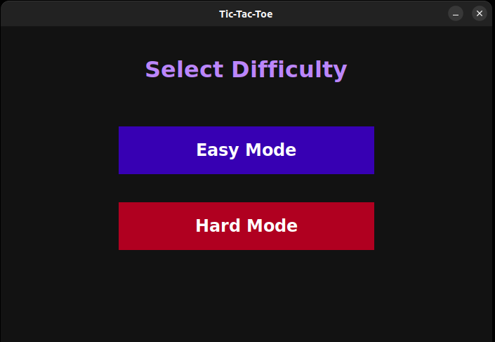
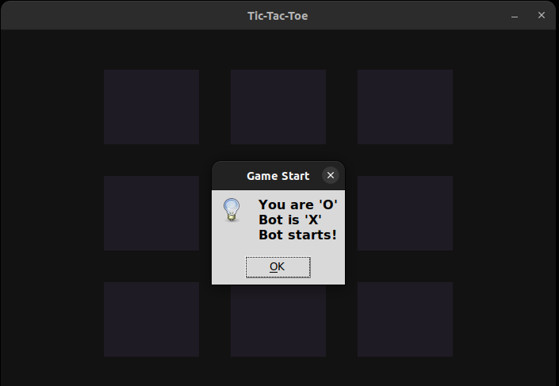
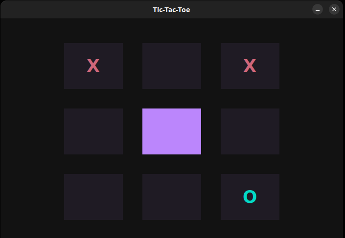
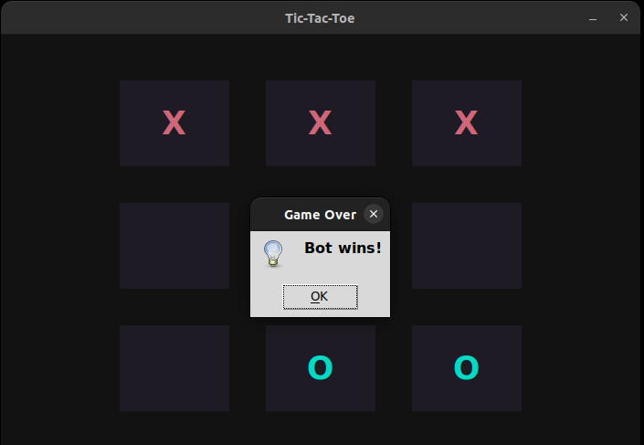

# Tic-Tac-Toe Game (C + Python)

A fun, cross-platform Tic-Tac-Toe game where a Python Tkinter GUI communicates with a C backend to power a smart opponent. The bot uses either random moves (easy mode) or the Minimax algorithm (hard mode) for unbeatable gameplay.

---

## 🌟 Features

✅ Random assignment of user/bot turns and symbols at the start
✅ Play against the computer in **Easy** or **Hard** mode
✅ Easy mode: bot makes random moves
✅ Hard mode: bot uses Minimax algorithm (AI)
✅ Cross-platform compatibility (Linux and Windows)
✅ Clean, animated Tkinter GUI frontend
✅ Fast backend using compiled C logic
✅ Automated testing with pytest

---

## 🎨 Screenshots

| Main Menu            | Choose Difficulty      |
| -------------------- | ---------------------- |
|  |  |

| Symbols & Turns               | Gameplay                 | Game Over                 |
| ----------------------------- | ------------------------ | ------------------------- |
|  |  |  |


---

## ⚙️ Requirements

| Tool            | Version                               |
| --------------- | ------------------------------------- |
| Python          | ≥ 3.8                                 |
| GCC (Linux)     | Required for compiling `game_logic.c` |
| MinGW (Windows) | Optional for `.dll` build             |
| make            | (Linux/Unix only)                     |

> No external Python libraries are required. Tkinter is built-in.

---

## 📂 Project Structure

```
Tic-Tac-Toe/
├── .github/workflows/tests.yml     # CI for GitHub Actions
├── assets/                         # Screenshots for README
│   ├── main.png
│   ├── levels.png
│   ├── turns_symbols.png
│   ├── gameplay.png
│   └── game_over.png
├── backend/                        # C backend
│   ├── game_logic.c                # Core game logic (C)
│   ├── Makefile                    # Linux build script
│   └── build.bat                   # Windows build script
├── frontend/                       # GUI frontend
│   └── game_gui.py                 # Python Tkinter GUI
├── shared/                         # Compiled shared libs (.so / .dll)
│   └── .keep                       # Placeholder to keep the folder in Git
├── tests/                          # Pytest test suite
│   └── test_game.py                # Unit tests for backend functions
├── .gitignore                      # Ignore binaries, cache, etc.
├── LICENSE                         # MIT License
├── README.md                       # You are here
```

> Note: `shared/` is ignored from Git for portability. Users must build `.so` or `.dll`.

---

## 💪 How to Build & Run

### 🌬️ Linux

```bash
git clone https://github.com/waziri245/Tic-Tac-Toe.git
cd Tic-Tac-Toe/backend
make                        # Builds libgame_logic.so into ../shared/
cd ../frontend
python3 game_gui.py
```

### 🌐 Windows

```cmd
git clone https://github.com/waziri245/Tic-Tac-Toe.git
cd Tic-Tac-Toe\backend
build.bat                  # Builds game_logic.dll into ..\shared\
cd ..\frontend
python game_gui.py
```

---

## 📁 How It Works

* The Python GUI loads a shared C library using `ctypes`.
* Game logic is handled in C for performance.
* The bot can play intelligently (Minimax) or randomly (Easy).
* Python GUI tracks player moves and updates the UI.

---

## ✌️ License

This project is licensed under the terms of the MIT License. See the LICENSE file for details.

---

## 🧑‍💻 Author

**Developed by:** Atal Abdullah Waziri,
Co-founder of  [Stellar Organization](https://stellarorganization.mystrikingly.com/).

Thanks for playing — may the odds be ever in your corner! 🚀
